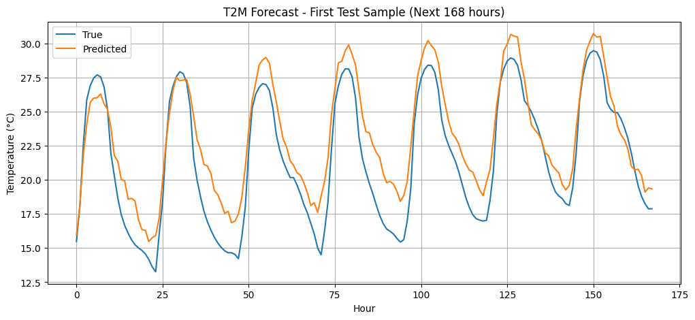

# 🌤️ Hourly Weather Forecasting Using Stacked Bi-directional LSTM


## 📌 Overview

This project builds a **Recurrent Neural Network (RNN)** model using **stacked Bi-directional LSTM** layers to forecast **hourly temperature (T2M)** for the next **168 hours (7 days)**, based on the **past 168 hours** of multivariate weather data. The model leverages **temporal dependencies** in meteorological data and includes both sensor and time-based features to generate accurate forecasts.


## 🧠 Objective

- Predict `T2M` (temperature at 2 meters) for the next **168 hours**
- Input: past 168 hours of hourly weather data
- Output: sequence of 168 future hourly temperature values
- Architecture: **Stacked Bi-directional LSTM** for sequence-to-sequence forecasting


## 🗃️ Dataset

The dataset contains **hourly records** from **1 January 2015 to 31 December 2023**, with the following features:

| Column Name     | Description                         | Units            |
|------------------|-------------------------------------|------------------|
| `T2M`            | Temperature at 2 meters             | °C               |
| `QV2M`           | Specific Humidity at 2 meters       | g/kg             |
| `PRECTOTCORR`    | Corrected Precipitation             | mm/hour          |
| `PS`             | Surface Pressure                    | kPa              |
| `WS10M`          | Wind Speed at 10 meters             | m/s              |
| `WD10M`          | Wind Direction at 10 meters         | degrees (0–360)  |
| `DAYTIME`        | Timestamp                           | DD.MM.YYYY HH:mm |


## ⚙️ Pipeline Steps

### 1. Install & Import Dependencies

Uses:
- `TensorFlow` / `Keras` for model building
- `NumPy`, `Pandas`, and `Matplotlib` for data handling and visualization
- `scikit-learn` for scaling and preprocessing


### 2. Load and Parse the Dataset

- Load CSV into a DataFrame
- Convert `DAYTIME` to datetime objects
- Sort records in chronological order


### 3. 🔧 Feature Engineering

#### ➤ Cyclic Feature Encoding (Wind Direction)
```python
df['WD10M_sin'] = np.sin(np.radians(df['WD10M']))
df['WD10M_cos'] = np.cos(np.radians(df['WD10M']))
```

#### ➤ Datetime Encoding

To capture the cyclical nature of time (e.g., hour of day), the `hour` is extracted from the timestamp and encoded using sine and cosine transforms:

```python
df['hour_sin'] = sin(2π * hour / 24)
df['hour_cos'] = cos(2π * hour / 24)
```


### 4. 🧪 Data Splitting

- **Training Set**: 70%  
- **Validation Set**: 20%  
- **Test Set**: 10%  
- All splits are **chronologically ordered** to preserve the temporal structure of the time series data.  
- **No shuffling** is applied during splitting.


### 5. 📏 Normalization

- Both input features and the target variable (`T2M`) are scaled using `StandardScaler` from `scikit-learn`.
- **Input Features**:  
  - All selected weather variables (e.g., `T2M`, `QV2M`, `PRECTOTCORR`, etc.)
- **Target Variable**:  
  - Only `T2M` is used as the prediction target and normalized separately.
- Scalers are **fit on the training set only** to prevent data leakage.


### 6. ⏳ Sequence Generation (Sliding Window)

- The data is transformed into overlapping input-output sequences:
  - **Input**: Past **168 hours** of multivariate data
  - **Output**: Next **168 hours** of `T2M`
- For a given time step `t`, the model uses:
  - Input window: `[t−168, ..., t−1]`
  - Output window: `[t, ..., t+167]`
- This forms a **sequence-to-sequence regression problem**.


### 7. 🧠 Model Architecture

A **stacked Bi-directional LSTM** is used to capture temporal dependencies in both forward and backward directions:

```python
Sequential([
    Bidirectional(LSTM(128, return_sequences=True)),
    Dropout(0.2),
    Bidirectional(LSTM(64)),
    Dense(168)  # Output 168 future T2M values
])
```


### ⚙️ Training Configuration

- **Loss Function**: Mean Squared Error (MSE)  
- **Optimizer**: Adam  
- **Metrics**: Root Mean Squared Error (RMSE)  
- **EarlyStopping**: Enabled, monitoring validation loss with `patience=5`


## 📈 Evaluation

- The trained model is evaluated on the **test set**
- **Root Mean Squared Error (RMSE)** is used to measure prediction accuracy
- A **visual comparison** between the predicted and actual `T2M` values is plotted for the **first test sequence**


### 🔍 Prediction Plot




## 🧪 Performance Metrics

| Metric     | Value            |
|------------|------------------|
| Test Loss  | *0.1629*         |
| Test RMSE  | *0.3446 °C*      |


## 📬 Let's Connect

I'm always open to feedback, collaboration, or career opportunities!

🔗 [LinkedIn](https://www.linkedin.com/in/mmbillah804/)  
🔗 [GitHub](https://github.com/mmbillah804)

